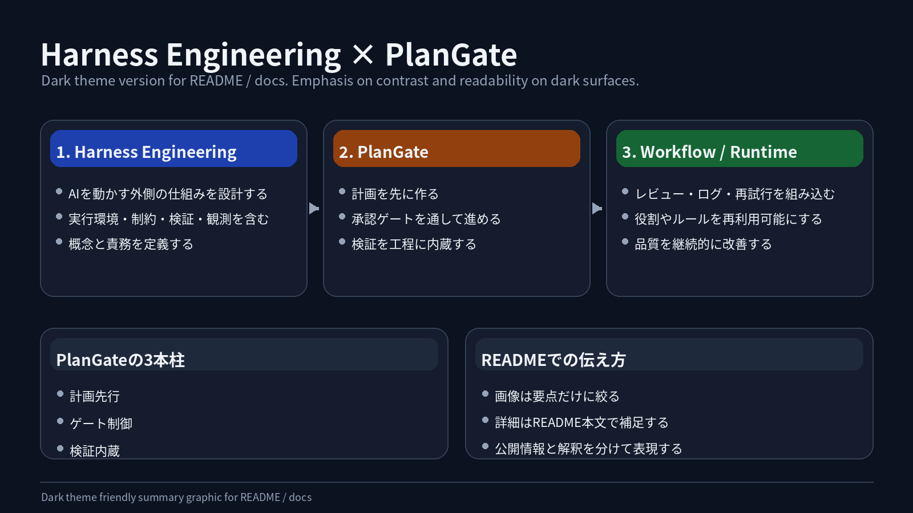

# PlanGate の思想と問題設定

PlanGate は、AI コーディングエージェントを「速くコードを書く存在」としてだけ扱うのではなく、計画、承認、実装、検証、handoff を持つ開発ワークフローの中に置くための仕組みです。

この文書では、PlanGate が向き合う課題、ハーネスエンジニアリングとの関係、設計上の意図を説明します。具体的な操作手順は [docs/plangate.md](./plangate.md)、v7 の構造は [docs/plangate-v7-hybrid.md](./plangate-v7-hybrid.md) を参照してください。

## なぜ必要か

AI コーディングエージェントは、実装速度を大きく引き上げます。一方で、実装前の計画、承認境界、検証条件、完了判断が弱いまま使うと、速さの裏側で品質と責任の所在が曖昧になります。

特に問題になるのは、AI が「良かれと思って」先回りすることです。未承認のスコープを実装する、テストを後回しにする、失敗した手順を説明せず別案に迂回する、会話の流れだけで完了を宣言する。これらはモデル単体の性能だけでは解けません。

PlanGate は、こうした問題をプロンプトの注意書きではなく、ワークフローと成果物で抑えることを目指します。

## ハーネスエンジニアリングとの関係

ここでいうハーネスエンジニアリングは、AI エージェントを安全に動かすための外枠を設計する考え方です。モデルに直接「慎重にやって」と頼るのではなく、実行環境、承認境界、検証、ログ、再実行条件を整え、AI の振る舞いを運用可能な形にします。

PlanGate は、その一般的な考え方を PBI 単位の開発ワークフローに落とし込むものです。

| 一般的な関心 | PlanGate での具体化 |
| --- | --- |
| 実行前に止める | C-3 ゲートで承認前の実装を禁止する |
| 入出力を固定する | `pbi-input.md`, `plan.md`, `todo.md`, `test-cases.md` を成果物にする |
| 検証を組み込む | L-0 / V-1〜V-4 を実装後フローに含める |
| 状態を保存する | `status.md`, `current-state.md`, `handoff.md` に経緯を残す |
| 役割を分離する | v7 で Workflow / Skill / Agent を分ける |

PlanGate が足したいものは、単なる「AI を制御する仕組み」ではありません。開発チームが AI に任せる範囲、人間が判断する範囲、検証で確認する範囲を、毎回同じ形で扱えるようにすることです。

## PlanGate の 3 本柱

### 1. 計画先行

AI は実装前に計画を出します。計画には、対象範囲、非対象範囲、タスク分解、テスト観点、リスクを含めます。

重要なのは、計画を「参考情報」ではなく「実行許可の前提」にすることです。PlanGate では、計画がレビューされ承認されるまで Agent 実行に進めません。

### 2. ゲート制御

PlanGate は、人間の判断点を C-3 と C-4 に集約します。

- C-3: 実装前の計画承認
- C-4: PR 上の最終レビュー

人間が全ステップを手で監視するのではなく、AI が準備した成果物と検証結果をもとに、重要な境界で判断します。

### 3. 検証内蔵

検証は「最後に余裕があればやるもの」ではなく、ワークフローの一部です。

PlanGate では、リンター自動修正、受け入れ検査、コード最適化、外部モデルレビュー、リリース前チェックを段階的に配置します。すべての案件で最大構成を使うのではなく、タスク規模に応じて必要な検証を選びます。

## 向き合う課題

### AI 実装が計画より先行しやすい

AI エージェントは、曖昧な要求からでもすぐ実装に進めます。これはプロトタイプでは強みですが、プロダクション開発ではスコープ逸脱や設計不足につながります。

PlanGate は、PBI から plan / todo / test-cases を作り、人間が C-3 で承認するまで実装を止めます。

### 承認境界が曖昧になりやすい

会話ベースの開発では、「どこまで承認されたのか」「どの変更は追加判断が必要なのか」が曖昧になります。

PlanGate は、APPROVE / CONDITIONAL / REJECT の三値ゲートを使い、承認状態をファイルとフローに残します。実装中にスコープ変更が必要になった場合も、勝手に進めず人間判断に戻すことを前提にします。

### 検証が後付けになりやすい

AI はコード生成を先に進めやすく、検証は後段に寄りがちです。結果として、テスト観点が実装後に都合よく狭まる危険があります。

PlanGate では、実装前に `test-cases.md` を作り、実装後に V-1 で受け入れ条件と突合します。検証観点を後から作るのではなく、計画段階の成果物として先に固定します。

### コンテキストや評価基準が個人依存になりやすい

AI 開発はセッション、担当者、ツールごとに判断が揺れやすくなります。何を前提にしたのか、なぜその設計にしたのか、何を既知課題として残したのかが会話ログだけに残ると、チームで再利用しにくくなります。

PlanGate は、チケット単位の `docs/working/TASK-XXXX/` に成果物を集約します。v7 では `design.md` と `handoff.md` を強化し、実装前後の判断を次の作業へ渡せる形にします。

## 公開情報と設計解釈の区別

PlanGate は、既存の AI 駆動開発、Spec-Driven Development、Skill / Agent 設計、ハーネスエンジニアリングの知見を参考にしています。

一方で、このリポジトリに書かれている PlanGate のフェーズ、ゲート、成果物、v7 ハイブリッド構造は、PlanGate としての設計解釈です。外部の一般論をそのまま写した仕様ではなく、PBI 単位の開発運用に合わせて再構成しています。

そのため、本文では次を分けて扱います。

- 一般的な考え方: AI を安全に動かす外枠、承認、検証、ログ、再実行条件を整える
- PlanGate の設計判断: C-3 / C-4 ゲート、A〜D / L-0 / V-1〜V-4、Workflow / Skill / Agent 3 層

## 向いている場面

PlanGate は、AI コーディングエージェントをプロダクション開発に組み込みたいチームに向いています。

- スプリント単位の PBI を AI 実装に渡したい
- 実装速度だけでなく、承認と検証の再現性を重視したい
- AI の判断を会話ログではなく成果物として残したい
- 複数の AI ツールや Agent を役割分担して使いたい

一方で、短時間の実験、個人のプロトタイプ、探索的な Vibe Coding には重すぎる場合があります。PlanGate は「速く試す」よりも、「速さを保ったままチームで扱える形にする」ための仕組みです。

## Read Next

| ドキュメント | 内容 |
| --- | --- |
| [docs/plangate.md](./plangate.md) | 運用手順、フェーズ、ゲート、検証ステップ |
| [docs/plangate-v7-hybrid.md](./plangate-v7-hybrid.md) | Governance × Modularity の v7 構造 |
| [docs/workflows/README.md](./workflows/README.md) | WF-01〜WF-05 の Workflow 定義 |
| [docs/ai/tool-roles.md](./ai/tool-roles.md) | Claude Code と Codex CLI の役割分担 |
