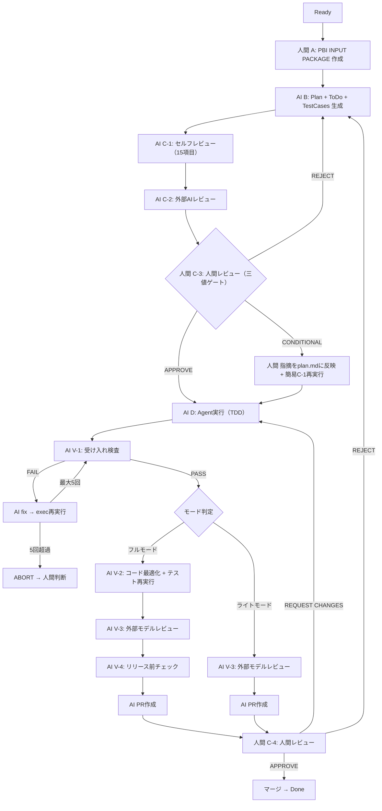

# PlanGate v4 -- フェーズD拡張設計（takt知見統合）

## 概要

PlanGate v3のフェーズD（Agent実行）を構造化・拡張し、**takt（マルチエージェント協調OSS）の実践知見**を統合したv4設計。

**v4の主な変更点（v3からの差分）**

- 承認ゲート（C-3）の**三値化**（APPROVE / CONDITIONAL / REJECT）
- フェーズD内部を**V-1〜V-4の検証ステップ**として明示化
- **タスク規模による分岐**（ライトモード / フルモード）の導入
- **PR作成後の人間レビュー**をC-4として明示的にゲート化
- taktの「受け入れ検査」「コード最適化」フェーズの取り込み

> 参考: [taktでCodex・Cursor・Claude Codeを協調させてみた（coji氏）](https://zenn.dev/coji/articles/takt-multi-agent-coding-experience)

---

## v4全体フロー

---

## v3 → v4 変更点の詳細

### 変更1: 承認ゲート（C-3）の三値化

**v3**: Approved / Changes requiredの二択

**v4**: APPROVE / CONDITIONAL / REJECTの三値

| 判定 | 意味 | 次のアクション |
| --- | --- | --- |
| **APPROVE** | 指摘なし or 軽微な改善提案のみ | execへ進行 |
| **CONDITIONAL** | 要修正だが計画の骨格は有効 | 指摘をplan.mdに反映+**簡易C-1再実行** → execへ |
| **REJECT** | 根本的な問題あり | planからやり直し |

**判定基準テンプレート**（taktのcoji氏の5回ABORT教訓から）:

- APPROVE: 指摘なし、または軽微な改善提案のみ（実装に支障なし）
- CONDITIONAL: 受入基準の補足、テストケースの追加など。計画の方向性は正しい
- REJECT: 要件の矛盾、変更対象の致命的な漏れ、スコープの根本的なズレ
- **軽微な改善提案はAPPROVEとして指摘事項に記載する**
- **実装者が判断できるレベルの曖昧さはREJECTにしない**

**CONDITIONALフロー時のIron Law整合性**:

CONDITIONALの場合、re-planは不要だが、Iron Law「NO EXECUTION WITHOUT REVIEWED PLAN FIRST」を維持するため、**修正箇所に限定した簡易C-1再実行**を挟む。これにより、修正後の計画もレビュー済みであることが保証される。

---

### 変更2: フェーズD内部の検証ステップ明示化（V-1〜V-4）

v3ではフェーズDの内部フローが暗黙的だった。v4ではTDD検証をexecの完了条件に統合し、後続を**V（Verification）ナンバリング**で明示化。

**v3内部フロー → v4マッピング**

| v3フェーズD内部 | v4での対応 |
| --- | --- |
| 準備 | execの前処理（変更なし） |
| 実装 | exec（TDD実装） |
| セルフレビュー1 | execの完了条件に統合（テスト全パス確認） |
| 検証+E2E | V-1受け入れ検査に統合 |
| セルフレビュー2 | V-3外部モデルレビューに統合 |
| orchestratorレビュー | V-3外部モデルレビューに統合 |
| 完了 | PR作成 |

**V系ステップの定義**

| ステップ | 名称 | 内容 | edit権限 |
| --- | --- | --- | --- |
| exec | TDD実装 | テスト全パスがexecの完了条件 | あり |
| **V-1** | 受け入れ検査 | test-cases.mdの完了条件 × 実装の突合検査 | なし |
| **V-2** | コード最適化 | 冗長コード削減・可読性向上（フルモードのみ） | あり |
| **V-3** | 外部モデルレビュー | 外部AI検査（設計品質チェック） | なし |
| **V-4** | リリース前チェック | PR作成前の最終品質ゲート（フルモードのみ） | なし |

#### V-1: 受け入れ検査（taktのacceptanceフェーズ取り込み）

**目的**: test-cases.mdに記載された完了条件を1つずつ機械的に突合する。

- 仕様に書かれた通りに実装されているかだけに集中
- コード品質や設計上の問題はV-3の役割
- FAIL時はfix loop発動（最大5回 → exec再実行）
- **5回超過時はABORT → 人間が原因を判断し、plan見直しまたは手動修正を決定**

#### V-2: コード最適化（taktのsimplifyフェーズ取り込み）

**目的**: 受け入れ検査合格後のコード品質向上。

- 対象: 重複コードの統合、命名の改善、不要な中間変数の削除、過剰な抽象化の簡素化
- **制約: 動作を変えない改善に限定**
- **最適化後、テスト再実行（回帰確認）が完了条件**
- フルモードのみ実行

#### V-3: 外部モデルレビュー

**目的**: 仕様外の設計品質チェック。

- v3のセルフレビュー2+orchestratorレビューを統合
- 自己レビュー観点も含めてチェック
- 仕様ベース検査（V-1）の盲点を補完する役割

#### V-4: リリース前チェック

**目的**: PR作成前の最終品質ゲート。フルモードのみ実行。

---

### 変更3: タスク規模による分岐（ライト / フル）

plan.mdにタスク規模を記載し、approveゲート（C-3）で人間が確定。

| モード | 対象 | 検証ステップ | 合計 |
| --- | --- | --- | --- |
| **ライト** | バグ修正・設定変更・1ファイル以内の変更 | V-1 → V-3 | 2ステップ |
| **フル** | 機能追加・リファクター・複数ファイル変更 | V-1 → V-2 → V-3 → V-4 | 4ステップ |

---

### 変更4: PR作成後の人間レビュー（C-4）明示化

v3では暗黙的だった人間レビューを、**C-4**として明示的にゲート化。GitHubのPRレビュー機能と直接対応。

> **ナンバリング補足**: C-1（セルフレビュー）→ C-2（外部AI）→ C-3（人間承認ゲート）→ C-4（PR人間レビュー）の連番。C系は「人間またはAIによるチェックポイント」、V系は「フェーズD内部の検証ステップ」として体系を分離。

| 判定 | 意味 | 次のアクション |
| --- | --- | --- |
| **APPROVE** | 問題なし | マージ → Done |
| **REQUEST CHANGES** | 修正が必要 | 修正指示 → execから再実行 |
| **REJECT** | 根本的にやり直し | planからやり直し（稀） |

---

## 3コマンドシステムとの対応

3コマンド体制は維持。人間の操作ステップは増えない。

| コマンド | v3 | v4 |
| --- | --- | --- |
| `plan` | Plan+ToDo+TestCases生成 | 同左+**タスク規模の判定** |
| `approve` | Approved / Changes required | **APPROVE / CONDITIONAL / REJECT** |
| `exec` | TDD → レビュー → PR | TDD → **V-1〜V-4自動実行** → PR |

人間が触るのは**approve（C-3: 計画承認）** と**C-4（PRレビュー、GitHub上）** の2箇所だけ。

---

## Iron Law（v4継続）

v3の6ルールをそのまま継続。v4の拡張はIron Lawの下流（V-1〜V-4）に限定し、Iron Law自体は変更しない。

**「TWO-STAGE REVIEW」のv4における解釈**:

v4ではレビューステップが拡張されているが、Iron Lawの「TWO-STAGE」は以下の2段階を指す:

1. **計画段階のWチェック**: C-1（セルフレビュー）+C-2（外部AIレビュー）
2. **実装段階のVチェック**: V-1〜V-4（受け入れ検査〜リリース前チェック）

この2段階（計画品質 × 実装品質）を経ないとマージできない、という原則は維持される。

---

## Wチェックの進化

| 概念 | v3 | v4 |
| --- | --- | --- |
| 計画段階のWチェック | C-1（セルフ）+C-2（外部AI） | **変更なし** |
| 実装段階のWチェック | セルフレビュー2+orchestratorレビュー（暗黙的） | **V-1（仕様適合）+V-3（設計品質）に分離・明示化** |

v4では実装段階のWチェックが**役割分離**される:

- V-1は「仕様に書いた通りに実装されているか」（仕様適合性）
- V-3は「仕様に書かれていない設計品質の問題はないか」（設計品質）

---

## workflow-conductor v4更新概要

v3の5つの役割を維持しつつ、V系ステップの管理を追加。

| # | 役割 | v4追加事項 |
| --- | --- | --- |
| 1 | フェーズ遷移管理 | **V-1〜V-4の遷移管理を追加。モード判定に基づく分岐制御** |
| 2 | 並列タスク実行判断 | 変更なし |
| 3 | 変更伝播 | **V-2でのコード変更をtest-cases突合に反映** |
| 4 | チェック漏れ防止 | **V-1のPASS/FAIL判定結果、V-2の回帰テスト結果を証拠として記録** |
| 5 | セッション復旧 | **V系ステップの進行状況もstatus.mdに記録し、中断時にV-Nから再開可能** |

**新規役割**:

| # | 役割 | 概要 |
| --- | --- | --- |
| 6 | **fix loop管理** | V-1 FAIL時のfix loop回数カウント。最大5回でABORT → 人間判断へエスカレーション |
| 7 | **モード分岐制御** | plan.mdのタスク規模に基づき、V-2/V-4のスキップ判定を自動実行 |

---

## 評価指標（v4追加）

v3の指標に加え、v4で以下を追加。

| 指標 | 目標 |
| --- | --- |
| V-1受け入れ検査一発合格率 | 80%以上 |
| V-1 fix loop回数 | 平均1回以内 |
| V-2最適化によるコード行数削減率 | 計測中 |
| ライト/フルモード適用比率 | 計測中 |
| **C-3判定分布（APPROVE/CONDITIONAL/REJECT比率）** | 計測中 |

> C-3の判定分布はPBI INPUT PACKAGEやtest-cases.mdの品質改善のヒントになる。CONDITIONAL率が高い場合、PBI INPUT PACKAGEのテンプレート改善を検討する。

---

## 注意点・リスク

1. **仕様ベース検査の盲点**: V-1はtest-cases.mdに書かれた完了条件のみをチェック。書かれていないことは検査しない。V-3で必ず補完すること
2. **最適化後の回帰リスク**: V-2でテスト通過済みコードを変更するため、テスト再実行は必須
3. **ゲートの過剰化**: ライトモードの活用で軽微な変更のオーバーヘッドを防ぐ
4. **三値ゲートの判断基準**: CONDITIONALとREJECTの境界が曖昧にならないよう、判定基準テンプレートを必ず参照
5. **CONDITIONALフロー時のIron Law整合性**: 簡易C-1再実行を挟むことで「承認なしにコードを書かない」原則を維持。スキップ禁止
6. **fix loop上限超過**: 5回超過時はABORT → 人間判断。自動的にplanまで巻き戻さず、人間が原因を判断する

---

## taktからの取り込み整理

| taktの概念 | PlanGate v4での対応 |
| --- | --- |
| spec-review（仕様レビュー） | C-1+C-2（既存。v4変更なし） |
| implement（実装） | exec（TDD実装。v4変更なし） |
| acceptance（受け入れ検査） | **V-1として新規追加** |
| fix（修正ループ） | **V-1 FAIL → fix loopとして新規追加（最大5回+ABORT）** |
| simplify（コード簡素化） | **V-2コード最適化として新規追加** |
| ゲート条件の三値化 | **C-3のAPPROVE/CONDITIONAL/REJECT** |
