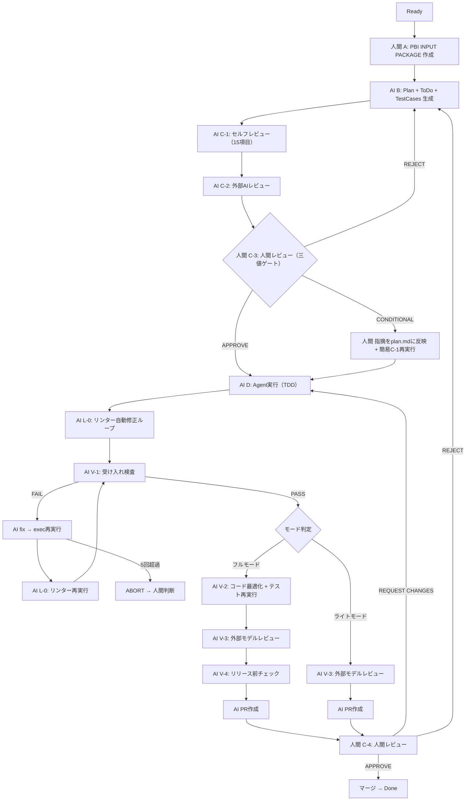

# PlanGate v5 -- L-0リンター自動修正ループ（ハーネスエンジニアリング知見統合）

## 概要

PlanGate v4のexecフェーズとV-1の間に**L-0（Lint Auto-Fix Loop）** を新設し、**ハーネスエンジニアリングの連続的フィードバック設計**を取り込んだv5設計。

**v5の主な変更点（v4からの差分）**

- exec → V-1の間に**L-0（リンター自動修正ループ）** を新設
- V-1 fix loop後にも**L-0再実行**を義務化
- workflow-conductorに**役割#8: L-0管理**を追加
- **ハーネスエンジニアリングの4領域モデルとの対応関係**を明示

> 参考: [Harness engineering: leveraging Codex in an agent-first world（OpenAI）](https://openai.com/index/harness-engineering/) / [GMO Developers: ハーネスで縛れ、AIに任せろ](https://developers.gmo.jp/technology/81389/) / [AI駆動開発協会: ハーネスエンジニアリング解説](https://aidd.jp/blog/knowledge/harness-engineering/)

---

## 背景: ハーネスエンジニアリングとPlanGateの差分分析

Mitchell Hashimoto（HashiCorp創業者）が2024年2月に提唱した「ハーネスエンジニアリング」は、AIモデルそのものではなく「AIが動く環境全体」を設計する思想。PlanGate v4との比較で残る主な差分は以下の3つだった。

| # | 差分要素 | ハーネスエンジニアリングの概念 | PlanGate v4の状態 | v5対応 |
| --- | --- | --- | --- | --- |
| 1 | **連続的フィードバック（CI層）** | リンター・テストが自動で回り続ける | CIで走るがexec中はAIが意識していない | **v5で対応（本ページ）** |
| 2 | ガベージコレクション | 常駐型コードベース健全性チェック | 未対応 | v6以降で検討 |
| 3 | 運用設計（セッション横断品質追跡） | メトリクス蓄積・外部メモリ管理 | V-4詳細未定義 | v6以降で検討 |

---

## v5全体フロー



---

## L-0: リンター自動修正ループ -- 詳細設計

### 位置づけ

| 観点 | 説明 |
| --- | --- |
| **挿入位置** | exec（TDD全パス）→ **L-0** → V-1（受け入れ検査）の間 |
| **edit権限** | あり（autofixによるコード変更を行う） |
| **制約** | 動作を変えない改善に限定（テスト全パス状態を維持） |
| **ゲート種別** | V系（検証ステップ）ではなく**L系（Lint層）** として独立分類 |

### なぜexecの完了条件に統合しないか

execの完了条件は「テスト全パス」であり、TDDの原則として明快。リンターは**機能の正しさではなくコード品質**の問題であり、TDD完了条件とは性質が異なる。V-1前に品質ベースラインを揃えることで、V-1やV-3が「リンターで潰せるノイズ」に時間を取られなくなる。

### 3段階の処理フロー

#### Step 1: リンター＋フォーマッター自動実行

変更対象ファイルに対してautofix可能な違反を機械的に修正する。AIの判断を挟まない。

| 言語 | リンター | フォーマッター |
| --- | --- | --- |
| Python | `ruff check --fix` | `ruff format` |
| JavaScript/TypeScript | `eslint --fix` | `prettier --write` |

#### Step 2: autofix不可の違反に対するAI修正ループ

autofixできない違反（型エラー、複雑度超過、未使用importの意図判断など）が残った場合:

1. AIが違反内容を解釈して修正
2. リンター再実行
3. 確認

このループを**最大3回**繰り返す。

#### Step 3: ループ後もFAILなら抑制判断

3回で解消しない違反は`# noqa`（Python）/ `// eslint-disable-next-line`（JS/TS）等で**明示的に抑制**し、**V-3（外部モデルレビュー）の確認事項として申し送る**。

人間へのABORTは不要（リンター違反は致命的ではないため。V-1のfix loopとは異なる）。

### L-0の完了条件

| 条件 | 詳細 |
| --- | --- |
| リンター違反ゼロ（autofix+AI修正で解消） | → V-1へ進行 |
| 抑制済み違反のみ残存 | → 抑制リストをV-3申し送りに記録 → V-1へ進行 |
| テスト全パス維持 | → L-0での変更がテストを壊していないことを確認 |

---

## V-1 fix loop後のL-0再実行

V-1がFAILしてfix loopが発動した場合、修正コードにリンター違反が再発する可能性がある。そのため、fix loop後にも**L-0を再実行**する。

**フロー:**

```text
exec → L-0 → V-1(PASS) → 続行
exec → L-0 → V-1(FAIL) → fix → L-0(再) → V-1(再) → ...
```

L-0再実行時もStep 1〜3の同じフローを踏む。fix loop回数のカウントはV-1のFAIL回数でカウントし、L-0再実行は回数にカウントしない（L-0は品質ゲートであり機能ゲートではないため）。

---

## Iron Lawとの整合性

L-0はexecの後段であり、計画承認後の実装フェーズ内で完結する。

| Iron Law | L-0の整合性 |
| --- | --- |
| `NO EXECUTION WITHOUT REVIEWED PLAN FIRST` | 抵触なし（exec後に実行） |
| `NO SCOPE CHANGE WITHOUT USER APPROVAL` | 抵触なし（リンター修正はスコープ変更ではない） |
| `NO CODE WITHOUT APPROVED DESIGN FIRST` | 抵触なし（autofixは設計変更ではない） |
| `NO MERGE WITHOUT TWO-STAGE REVIEW` | L-0の変更もV-3で検査される |
| `NO COMPLETION CLAIMS WITHOUT FRESH VERIFICATION EVIDENCE` | L-0完了時にテスト全パスを確認 |
| `NO FIXES WITHOUT ROOT CAUSE INVESTIGATION FIRST` | 抵触なし（リンター違反は根本原因調査の対象外） |

---

## workflow-conductor v5更新

v4の7つの役割を維持しつつ、L-0管理を追加。

| # | 役割 | v5追加事項 |
| --- | --- | --- |
| 1 | フェーズ遷移管理 | **exec → L-0 → V-1の遷移を追加。fix loop後のL-0再実行を制御** |
| 2 | 並列タスク実行判断 | 変更なし |
| 3 | 変更伝播 | **L-0でのautofix変更もテスト全パス確認の対象に含める** |
| 4 | チェック漏れ防止 | **L-0の完了ログ（autofix件数・AI修正件数・抑制件数）を証拠として記録** |
| 5 | セッション復旧 | **L-0の進行状況もstatus.mdに記録（exec完了 / L-0実行中 / L-0完了）** |
| 6 | fix loop管理 | 変更なし |
| 7 | モード分岐制御 | 変更なし |

**新規役割:**

| # | 役割 | 概要 |
| --- | --- | --- |
| 8 | **L-0管理** | exec完了後にリンター自動実行を起動。autofix → AI修正ループ → 抑制の3段階を制御。抑制した違反をV-3申し送りリストに記録。fix loop後のL-0再実行もトリガー |

---

## GMO 4段階エスカレーションモデルとの対応

GMO Developersが公開したConoHa VPS開発での4段階エスカレーションラダーとの比較。

| GMOのレイヤー | 内容 | PlanGate v5での対応 |
| --- | --- | --- |
| L1: ドキュメント層 | CLAUDE.mdにルール記述 | Iron Law+CLAUDE.md |
| L2: AIセマンティックレビュー層 | Claude Code Review CIが差分を自然言語評価 | C-1/C-2（計画段階）+V-3（実装段階） |
| L3: CI層 | リンター・テストによる機械的チェック | **L-0（v5新規）** +exec（TDD） |
| L4: 構造テスト層 | アーキテクチャ境界・import制約の構造検証 | V-4（リリース前チェック、詳細別途定義） |

---

## ハーネスエンジニアリング4領域とPlanGate v5の対応

AI駆動開発協会（AIDD）の4領域モデルに対するPlanGate v5のカバレッジを整理。

| ハーネスエンジニアリングの領域 | PlanGate v5での対応 | カバレッジ |
| --- | --- | --- |
| **1. コンテキスト設計**（AIに何を見せるか） | CLAUDE.md+Iron Law+PBI INPUT PACKAGE+plan.md/todo.md/test-cases.md | 対応済 |
| **2. 行動設計**（AIに何をさせるか） | workflow-conductor+3コマンドシステム+C-3ゲート+モード分岐 | 対応済 |
| **3. フィードバック設計**（出力をどう評価・修正するか） | C-1/C-2+V-1〜V-4+fix loop+**L-0（v5新規）** | **v5で強化** |
| **4. 運用設計**（セッションをまたぐ継続的品質保持） | status.md+セッション復旧 | 部分的（v6検討） |

---

## 評価指標（v5追加）

v4の指標に加え、v5で以下を追加。

| 指標 | 目標 |
| --- | --- |
| L-0 autofix解消率 | 計測中（autofixで解消できた違反の割合） |
| L-0 AI修正ループ平均回数 | 1回以内 |
| L-0抑制発生率 | 5%以下（抑制に至った違反の割合） |
| V-3での抑制違反の問題検出率 | 計測中 |

---

## 注意点・リスク

1. **L-0のオーバーヘッド**: 小規模な変更でもリンター全実行するとコストがかかる。変更対象ファイルに限定した差分実行が望ましい
2. **autofix副作用**: `ruff check --fix`等のautofixが稀にテストを壊す可能性がある。テスト再実行を完了条件にすることで防御
3. **抑制の濫用**: `# noqa`の濫用を防ぐため、V-3での抑制違反チェックを確実に実施する必要がある
4. **fix loop後のL-0再実行コスト**: fix loopが複数回発生するとL-0も複数回走る。ただしL-0自体は軽量（秒単位）なので実質的な問題は小さい

---

## v3 → v4 → v5 進化の系譜

| バージョン | 主な追加 | 統合した外部知見 |
| --- | --- | --- |
| v3 | Wチェック+Iron Law+workflow-conductor | obra/superpowers, Spec-Driven Starter |
| v4 | C-3三値化+V-1〜V-4+ライト/フルモード+C-4 | takt（マルチエージェント協調） |
| **v5** | **L-0リンター自動修正ループ** | **ハーネスエンジニアリング（フィードバック設計）** |
| v6（予定） | ガベージコレクション+運用設計強化 | ハーネスエンジニアリング（運用設計） |
