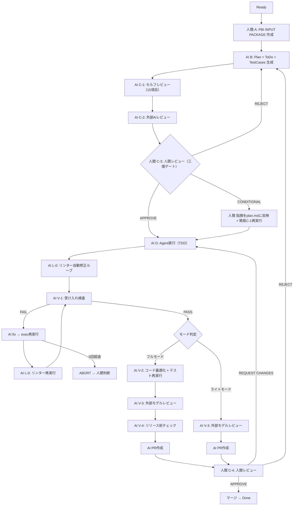

# PlanGate -- ゲート型AI駆動開発ガイド

**PlanGate(プランゲート)** は、AIコーディングエージェント(Claude Code)を活用した開発ワークフローです。

**「計画を承認しないとAIは1行もコードを書けない」** という関所モデルを採用し、AIの暴走を防ぎつつ開発速度を最大化します。

> **一言で言うと**: 人間がPBIを書き、AIが計画を立て、人間が承認し、AIが実装する。この4ステップを3コマンドで回す仕組みです。

## スクラムとの関係

PlanGateは**スクラムのDone定義の中で「AIにコードを書かせるフェーズ」を安全に回す仕組み**です。スクラムのイベント(リファインメント・プランニング・レトロスペクティブ)を置き換えるものではありません。

| 責務 | 担当 |
| --- | --- |
| PBIの情報管理・更新 | スクラムイベント(リファインメント・プランニング) |
| Done条件の確認・判定 | PO / スクラムチーム |
| ベロシティ計測・スループット管理 | スクラムチーム |
| **AIへの計画承認 → 実装 → PR作成** | **PlanGate(C-3承認ゲート以降)** |

---

## なぜPlanGateが必要か

AIコーディングエージェントは強力ですが、放っておくと以下の問題を起こします。

- **スコープの暴走**: 指示を拡大解釈して、頼んでいない機能を勝手に追加する
- **テストの省略**: 「テストは後で」と合理化して、テストなしでコードを書く
- **失敗の隠蔽**: エラーが出ても別のアプローチに迂回し、完了を宣言する
- **セッション間のブレ**: 同じプロダクトでもセッションが変わると判断基準がブレる

PlanGateはこれらを**構造的に防止**します。ルールや注意力ではなく、仕組みで解決するアプローチです。

---

## 全体像

### フロー(3コマンドで完結)



> **図の見方**: 人間 = 人間タスク / AI = AIタスク / C-3がゲート(通過するまでAgent実行禁止) / V系 = 実装段階の検証ステップ / L-0 = リンター自動修正

### 各フェーズの役割

| フェーズ | 誰が | 何をする | 成果物 |
| --- | --- | --- | --- |
| **A**: PBI INPUT | 人間 | 要件・スコープ・受入基準を記入 | `pbi-input.md` |
| **B**: Plan生成 | AI | 計画・タスク分解・テストケース定義を同時生成 | `plan.md` `todo.md` `test-cases.md` |
| **C-1**: セルフレビュー | AI | 15項目のPASS/WARN/FAILチェック | `review-self.md` |
| **C-2**: 外部AIレビュー | AI | 別AIモデルによる独立チェック | `review-external.md` |
| **C-3**: 人間レビュー | **ゲート** | C-1/C-2の結果を踏まえて三値判断 | APPROVE / CONDITIONAL / REJECT |
| **D**: Agent実行 | AI | TDDで実装(テスト全パスが完了条件) | 実装コード |
| **L-0**: リンター自動修正 | AI | autofix → AI修正最大3回 → 抑制+V-3申し送り | リンター通過済みコード |
| **V-1**: 受け入れ検査 | AI | test-cases.mdの完了条件を1つずつ機械的に突合 | PASS / FAIL(FAIL時はfix loop最大5回) |
| **V-2**: コード最適化 | AI | 冗長コード削減・可読性向上(フルモードのみ) | 最適化済みコード+テスト再実行 |
| **V-3**: 外部モデルレビュー | AI | 外部AI(Gemini等)による設計品質チェック | レビュー結果 |
| **V-4**: リリース前チェック | AI | PR作成前の最終品質ゲート(フルモードのみ) | チェック結果 |
| **PR作成** | AI | GitHubにPull Request作成 | PR |
| **C-4**: 人間レビュー | **ゲート** | PRの最終レビュー(GitHub上) | APPROVE / REQUEST CHANGES / REJECT |

### タスク規模による分岐

| モード | 対象 | 検証ステップ |
| --- | --- | --- |
| **ライト** | バグ修正・設定変更・1ファイル以内の変更 | L-0 → V-1 → V-3 → PR → C-4 |
| **フル** | 機能追加・リファクター・複数ファイル変更 | L-0 → V-1 → V-2 → V-3 → V-4 → PR → C-4 |

---

## PlanGateの3つの核心

### 1. Wチェック(二重検証)

Planが人間の目に届く前に、2段階の自動チェックが走ります。

#### C-1 セルフレビュー(15項目)

AI自身が「この計画で本当に大丈夫か」をPlan 7項目+ToDo 5項目+TestCases 3項目で自己検証します。受入基準の網羅性、スコープ制御、テスト戦略などを自動チェック。

#### C-2 外部AIレビュー

別のAIモデル(Gemini等)がorchestrator経由で独立チェック。同一AIの盲点を別のAIで補完する構造です。

この2段階フィルターにより、**人間のレビュー負荷が大幅に軽減**されます。C-1/C-2で問題が検出されたPlanは人間の目に届く前に差し戻されます。

#### 実装段階のWチェック

実装段階にもV系ステップとしてWチェックが拡張されています。V-1(仕様適合性)とV-3(設計品質)の2観点で実装を検証します。

| 段階 | 計画品質 | 実装品質 |
| --- | --- | --- |
| 仕様適合性 | C-1(セルフレビュー) | V-1(受け入れ検査) |
| 設計品質 | C-2(外部AIレビュー) | V-3(外部モデルレビュー) |

### 2. Iron Law(絶対ルール)

違反したら即停止する不可侵ルールが6つ設定されています。

| ルール | 意味 |
| --- | --- |
| `NO EXECUTION WITHOUT REVIEWED PLAN FIRST` | 承認なしにコードを書くな |
| `NO SCOPE CHANGE WITHOUT USER APPROVAL` | 勝手にスコープを変えるな |
| `NO CODE WITHOUT APPROVED DESIGN FIRST` | 設計なしにコードを書くな |
| `NO MERGE WITHOUT TWO-STAGE REVIEW` | 2段階レビューなしにマージするな |
| `NO COMPLETION CLAIMS WITHOUT FRESH VERIFICATION EVIDENCE` | 証拠なしに完了と言うな |
| `NO FIXES WITHOUT ROOT CAUSE INVESTIGATION FIRST` | 原因調査なしに修正するな |

### 3. 多層防御(exec以降の自動検証)

execコマンド実行後、PR作成までに複数の自動検証ステップが走ります。どれか1つの防御壁で守るのではなく、複数を重ねて効かせる設計です。

- **L-0(リンター自動修正)** -- コード品質のベースラインを自動で揃える
- **V-1(受け入れ検査)** -- 仕様通りに実装されているかを機械的に検証
- **V-2(コード最適化)** -- 冗長コード削減・可読性向上(フルモードのみ)
- **V-3(外部モデルレビュー)** -- 仕様に書かれていない設計品質の問題を検出
- **V-4(リリース前チェック)** -- PR作成前の最終品質ゲート(フルモードのみ)
- **C-4(人間レビュー)** -- GitHub上での最終承認

これにより、人間が触るのは**C-3(計画承認)** と**C-4(PRレビュー)** の2箇所だけで、その間の品質保証はすべて自動で回ります。

---

## 運用の流れ(実際の手順)

### Step 1: PBI INPUT PACKAGEを書く(人間)

`docs/working/TASK-XXXX/pbi-input.md`に以下を記入:

- **Context / Why** -- なぜやるか
- **What(Scope)** -- In scope / Out of scope
- **受入基準** -- 検証可能な条件
- **Notes from Refinement** -- 議論で決まったこと
- **Estimation Evidence** -- Risks / Unknowns / Assumptions

> 記入にかかる時間の目安: 15〜30分

### Step 2: Plan生成(AI)

```bash
/ai-dev-workflow TASK-XXXX plan
```

このコマンド1つで以下が自動実行されます:

1. pbi-input.mdを読み込み
2. plan.md + todo.md + test-cases.mdを同時生成
3. C-1セルフレビュー(15項目)を自動実行
4. C-2外部AIレビューを自動実行

### Step 3: 人間レビュー → 承認(人間)

C-1/C-2の結果を参考にしながら、plan.md / todo.md / test-cases.mdを確認し、三値で判断します。

- **APPROVE** → Step 4へ(指摘なし or 軽微な改善提案のみ)
- **CONDITIONAL** → 指摘をplan.mdに反映+簡易C-1再実行 → Step 4へ(計画の骨格は有効だが修正が必要)
- **REJECT** → Step 2に戻る(根本的な問題あり)

> レビュー時間の目標: 15分以内/PBI(C-1/C-2で事前フィルター済みのため)

### Step 4: Agent実行(AI)

```bash
/ai-dev-workflow TASK-XXXX exec
```

workflow-conductor(司令塔エージェント)がtodo.mdにしたがってタスクを順次実行します。exec以降はすべて自動で進行し、人間が触るのは**C-4(PRレビュー、GitHub上)** だけです。

**exec以降の自動フロー:**

1. **exec(TDD実装)** -- RED → GREEN → REFACTOR。テスト全パスが完了条件
2. **L-0(リンター自動修正)** -- autofix実行 → autofix不可の違反はAIが最大3回修正ループ → 解消しなければ明示的抑制(noqa等)してV-3に申し送り
3. **V-1(受け入れ検査)** -- test-cases.mdの完了条件を1つずつ機械的に突合。FAILなら fix → L-0再実行 → V-1再実行のループ(最大5回。超過時はABORT → 人間が原因を判断)
4. **V-2(コード最適化・フルモードのみ)** -- 冗長コード削減・可読性向上。動作を変えない改善に限定。最適化後にテスト再実行
5. **V-3(外部モデルレビュー)** -- 外部AI(Gemini等)が設計品質をチェック。V-1の「仕様に書いた通りか」を補完する「仕様に書かれていない問題はないか」の検査
6. **V-4(リリース前チェック・フルモードのみ)** -- PR作成前の最終品質ゲート
7. **PR作成** -- GitHubにPull Requestを自動作成
8. **C-4(人間レビュー)** -- GitHub上でPRをレビュー。APPROVE → マージ → Done / REQUEST CHANGES → execから再実行 / REJECT → planからやり直し(稀)

> **ライトモード**(バグ修正等)ではV-2とV-4をスキップし、L-0 → V-1 → V-3 → PR → C-4の最短パスで進行します。

---

## 他のアプローチとの違い

### vs Vibe Coding(自然言語で直接コーディング)

| 観点 | Vibe Coding | PlanGate |
| --- | --- | --- |
| 計画 | なし(直接実装) | 必須(承認ゲート) |
| 品質管理 | 人間が都度確認 | Wチェック+Iron Law |
| 再現性 | セッション依存 | チケット単位で全記録 |
| 向いている場面 | プロトタイプ・実験 | プロダクション開発 |

### vs Spec-Driven Development(仕様駆動開発)

| 観点 | Spec-Driven | PlanGate |
| --- | --- | --- |
| 核心 | 永続化ドキュメントでAIにガードレール | 承認ゲートでAIの実行を制御 |
| 仕様の扱い | 最初に仕様を固める | PBI単位で軽量に定義 |
| アジャイル適性 | やや弱い(文書が重い) | 高い(3コマンドで完結) |
| 人間の役割 | 仕様を書く | 要件を書く＋計画を承認する |

### vs obra/superpowers(スキル駆動開発)

| 観点 | Superpowers | PlanGate |
| --- | --- | --- |
| 核心 | AIにシニア開発者の規律を注入 | 計画承認ゲートで品質担保 |
| スキル数 | 14スキル | 3コマンド+conductor |
| 認知負荷 | やや高い(スキル体系の理解が必要) | 低い(plan → 承認 → exec) |
| 関係性 | PlanGateのIron Lawはsuperpowersから取り込み | 思想を内在化して再構成 |

### vs ハーネスエンジニアリング(環境設計思想)

2026年2月にMitchell Hashimoto(HashiCorp創業者)が命名した「AIが動く環境全体を設計する」思想。OpenAIの「3人で100万行・手書きコード0行」実験で広まった。PlanGateはこの思想の一実装パターンとして位置づけられます。

| 観点 | ハーネスエンジニアリング | PlanGate |
| --- | --- | --- |
| 性質 | 設計思想・方法論(特定のワークフローを規定しない) | 具体的なワークフロー定義(3コマンド+ゲート) |
| 制御方式 | 環境設計による暗黙的制約+ガードレール内での自律実行 | 計画承認ゲートによる明示的制御 |
| フィードバック | 連続的・反復的(テスト・リンター・レビューが自動で回り続ける) | ステップ単位のゲート(C-1→C-2→V-1→V-3)+L-0リンターループ |
| ルール強制 | ゴールデンプリンシプル(アーキテクチャ不変条件をリンターで機械的強制) | Iron Law(プロセス制約を人間承認で強制) |
| スクラム適性 | 言及なし(開発プロセスに非依存) | スプリント単位のPBIを前提に設計 |
| 関係性 | PlanGateはハーネスエンジニアリングの4領域のうち3領域をカバー | v5でフィードバック設計を強化、v6で運用設計を予定 |

**ハーネスエンジニアリング4領域とPlanGateのカバレッジ:**

| 領域 | PlanGate v5での対応 | 状態 |
| --- | --- | --- |
| 1. コンテキスト設計(AIに何を見せるか) | CLAUDE.md+Iron Law+PBI INPUT PACKAGE | 対応済 |
| 2. 行動設計(AIに何をさせるか) | workflow-conductor+3コマンド+C-3ゲート | 対応済 |
| 3. フィードバック設計(出力をどう評価するか) | C-1/C-2+V-1〜V-4+L-0リンターループ | v5で強化 |
| 4. 運用設計(セッション横断の品質保持) | status.md+セッション復旧 | 部分的(v6でガベージコレクション等を予定) |

---

## チケット単位の作業コンテキスト

1つのPBI(チケット)に対して1つの自己完結したディレクトリが生成されます。

```text
docs/working/TASK-XXXX/
├── pbi-input.md         # A: 人間が記入する入力
├── plan.md              # B: AIが生成する実行計画
├── todo.md              # B: AIが生成するタスクリスト(2〜5分粒度)
├── test-cases.md        # B: AIが生成するテストケース
├── review-self.md       # C-1: セルフレビュー結果
├── review-external.md   # C-2: 外部AIレビュー結果
└── status.md            # D: リアルタイム進捗
```

この構造により:

- **セッション復旧**: Claude Codeが切れてもstatus.md+todo.mdから再開できる
- **監査性**: plan.mdと実装の差分で計画と実行の乖離がわかる
- **再利用性**: 過去のTASK-XXXXディレクトリが類似PBIの参考になる

---

## workflow-conductor(司令塔エージェント)

フェーズDの実行を管理する専用エージェント(`.claude/agents/workflow-conductor.md`)。

| # | 役割 | 概要 |
| --- | --- | --- |
| 1 | フェーズ遷移管理 | C-3承認なしにexecに進まないゲートキーパー。exec → L-0 → V-1〜V-4の遷移も制御 |
| 2 | 並列タスク実行判断 | todo.mdのdepends_onを分析し、独立タスクを並列委譲 |
| 3 | 変更伝播 | todo/test-cases変更時に後続タスク・レビューに反映。L-0/V-2でのコード変更もテスト確認対象に含める |
| 4 | チェック漏れ防止 | 証拠なしにタスク完了を受理しない。V-1/V-2の結果、L-0の完了ログを証拠として記録 |
| 5 | セッション復旧 | status.md/todo.mdから現在地を復元。V系ステップの進行状況も記録し、中断時にV-Nから再開可能 |
| 6 | fix loop管理 | V-1 FAIL時のfix loop回数カウント。最大5回でABORT → 人間判断へエスカレーション |
| 7 | モード分岐制御 | plan.mdのタスク規模に基づき、V-2/V-4のスキップ判定を自動実行(ライト/フル) |
| 8 | L-0管理 | exec完了後にリンター自動実行。autofix → AI修正ループ → 抑制の3段階を制御 |

---

## 評価指標

PlanGateの効果を測定する指標が組み込まれています。

| 指標 | 目標 |
| --- | --- |
| Lead time(In Progress → PR ready) | 計測中 |
| Planレビュー差し戻し回数 | 1回以内/PBI |
| PRレビュー差し戻し回数 | 1回以内/PBI |
| 人間のPlanレビュー負荷 | 15分以内/PBI |
| 動作検証自動化率 | 80%以上 |
| Plan Review Agent精度 | 70%以上(Agent指摘と人間指摘の一致率) |
| チェックポイント遵守率 | 90%以上 |

---

## 導入に必要なもの

| 必要なもの | 説明 |
| --- | --- |
| Claude Code | AnthropicのAIコーディングエージェント(Pro/Team/Enterprise) |
| GitHubリポジトリ | `.claude/`ディレクトリとコマンド定義を配置 |
| Notionワークスペース | テンプレート・ガイドの社内共有用(任意) |

### ファイル構成

```text
.claude/
├── commands/
│   ├── ai-dev-workflow.md        # メインコマンド(plan/exec/brainstorm/status)
│   └── working-context.md        # 作業コンテキスト初期化
├── agents/
│   └── workflow-conductor.md     # フェーズD司令塔エージェント
└── rules/
    ├── working-context.md        # 作業コンテキスト管理ルール
    └── review-principles.md      # レビュー判定フレーム

docs/
├── plangate.md                   # PlanGateガイド(本ドキュメント)
├── ai-driven-development.md      # ワークフロー詳細・プロンプト集
└── working/
    ├── templates/                # テンプレート群
    └── TASK-XXXX/                # チケット単位の作業ディレクトリ
```

---

## 導入を検討するチームへ

PlanGateが向いているのは:

- AIコーディングエージェントを**プロダクション開発**に使いたいチーム
- AIの出力品質を**仕組みで担保**したいチーム
- アジャイル開発で**スプリント単位のPBI**を回しているチーム
- 「AIに任せたいけど、暴走が怖い」と感じているチーム

PlanGateが向いていないのは:

- プロトタイプや実験的な開発(Vibe Codingの方が速い)
- 1人で完結する個人プロジェクト(オーバースペック)
- AI開発をまだ試したことがないチーム(まずはVibe Codingで体験するのが先)

---

## よくある質問

**Q: 既存の「ステージ・ゲート法」と何が違うの?**

ステージ・ゲート法(Robert Cooper, 1990年代)は、製品開発プロジェクト全体のライフサイクル(企画→開発→テスト→ローンチ)にゲートを置き、経営層やステークホルダーがGo/Kill判断をする手法です。スパンは週〜月単位。

PlanGateのゲートは**PBI(チケット)1枚の中**に置きます。判断するのは開発者本人で、スパンは分〜時間単位。AIの「暴走」を防ぐためのゲートであり、ビジネス判断のゲートではありません。

| 観点 | ステージ・ゲート法 | PlanGate |
| --- | --- | --- |
| スケール | プロジェクト全体 | PBI 1枚 |
| 判断者 | 経営層・ステークホルダー | 開発者本人 |
| 判断内容 | このプロジェクトを続けるか | この計画でAIを走らせてよいか |
| スパン | 週〜月 | 分〜時間 |
| 目的 | ビジネスリスクの管理 | AIの暴走防止・実装品質の担保 |

共通点は「ゲートを通過しないと次に進めない」という構造的な品質管理の考え方です。ただしスケールがまったく異なるため、ステージ・ゲート法とPlanGateは競合ではなく、併用が可能です(プロジェクトレベルではステージ・ゲート法、PBIレベルではPlanGate)。

**Q: アジャイル開発と相性は良い?**

はい。PlanGateはスプリント単位のPBIを前提に設計されています。重い仕様書を事前に用意する必要はなく、PBI INPUT PACKAGE(15〜30分で記入)を起点にAIが計画を自動生成します。「仕様を固めてから開発」ではなく「PBIごとに計画→承認→実行を高速に回す」モデルです。

**Q: 導入コストは?**

技術的な導入は`.claude/`ディレクトリの配置のみ。チームの学習コストは`plan → 承認 → exec`の3ステップを理解するだけです。最初の1PBIを一緒にやれば、2PBI目からは自走できるレベルです。

**Q: Vibe Codingから移行すべき?**

必ずしもそうではありません。プロトタイプや実験にはVibe Codingの方が速いです。PlanGateは**プロダクションコードをAIに書かせるとき**に威力を発揮します。チーム内でVibe CodingとPlanGateを使い分けるのが現実的です。

---

## バージョン進化の系譜

| バージョン | 主な追加 | 統合した外部知見 |
| --- | --- | --- |
| v3 | Wチェック+Iron Law+workflow-conductor | obra/superpowers, Spec-Driven Starter |
| v4 | C-3三値化+V-1〜V-4+ライト/フルモード+C-4 | takt(マルチエージェント協調) |
| v5 | L-0リンター自動修正ループ | ハーネスエンジニアリング(フィードバック設計) |
| v6(予定) | 決定論的フック+ガベージコレクション+段階的ルール昇格 | ハーネスエンジニアリング(運用設計) |

---

## 関連資料

- [ワークフロー詳細・プロンプト集](ai-driven-development.md) -- 実装者向けリファレンス
- [PlanGate v4設計 -- takt知見統合](plangate-v4-design.md) -- フェーズD拡張設計の詳細
- [PlanGate v5設計 -- L-0リンター自動修正](plangate-v5-design.md) -- ハーネスエンジニアリング知見統合
- [PlanGate v6ロードマップ](plangate-v6-roadmap.md) -- ハーネスエンジニアリング差分解消
- [workflow-conductor定義](../.claude/agents/workflow-conductor.md) -- フェーズD司令塔エージェント
- [メインコマンド定義](../.claude/commands/ai-dev-workflow.md) -- `/ai-dev-workflow`コマンド
- [作業コンテキスト管理ルール](../.claude/rules/working-context.md) -- セッション管理
- [レビュー判定フレーム](../.claude/rules/review-principles.md) -- レビュー原則
