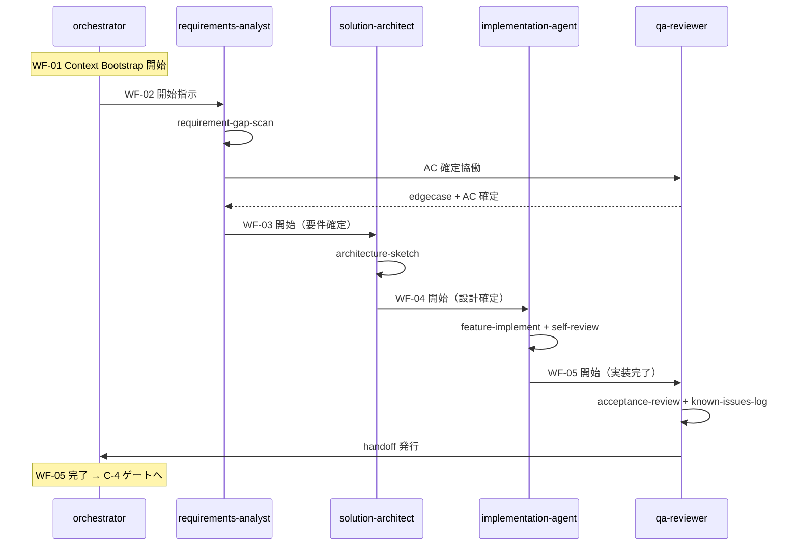

# 実行シーケンス（責務ベース Agent × Workflow）

> PlanGate × Workflow / Skill / Agent ハイブリッドアーキテクチャ
>
> 親 PBI: [#22](https://github.com/s977043/plangate/issues/22)

## 責務ベース Agent 5 体

| Agent | 責務 |
| ------- | ------ |
| `orchestrator` | ワークフロー遷移管理 / 誰に何を渡すか決める / 完了条件判定 |
| `requirements-analyst` | 初期要求を仕様に変換 / 曖昧さ・抜け漏れ・対象外を整理 |
| `solution-architect` | 実装構造を設計 / 依存制約や技術的妥協点を明文化 |
| `implementation-agent` | コードを書く / 小単位で自己レビュー / 既知課題を残す |
| `qa-reviewer` | 要件適合・回帰・未考慮ケースを確認 / V1/V2 境界整理 |

## 標準実行シーケンス

## Phase × Agent マッピング

| Phase | 主担当 Agent | 副担当 / 協働 |
| ------- | ------------- | -------------- |
| WF-01 Context Bootstrap | `orchestrator` | `requirements-analyst` |
| WF-02 Requirement Expansion | `requirements-analyst` | `qa-reviewer`（AC 確定） |
| WF-03 Solution Design | `solution-architect` | — |
| WF-04 Build & Refine | `implementation-agent` | — |
| WF-05 Verify & Handoff | `qa-reviewer` | `orchestrator`（handoff 発行） |

## 委譲ルール

1. **全ての phase 遷移は orchestrator 経由**（または orchestrator が委任した Agent 間の直接委譲）
2. 設計からの逸脱が必要な場合、`implementation-agent` は `solution-architect` に委譲
3. `qa-reviewer` は修正を行わず、問題を指摘して `implementation-agent` に委譲
4. 完了条件判定は `orchestrator` が最終決定

## PlanGate 既存フェーズとの対応

| Workflow | PlanGate 既存 |
| ---------- | -------------- |
| WF-01 Context Bootstrap | A（PBI INPUT PACKAGE 確認） |
| WF-02 Requirement Expansion | A / B の一部 |
| WF-03 Solution Design | B の一部 + C-1〜C-3 |
| WF-04 Build & Refine | D（exec）+ C-1 + L-0 |
| WF-05 Verify & Handoff | V-1〜V-4 + handoff（新設） |

詳細は `docs/workflows/README.md` 参照。

## 既存 PlanGate Agent との並立

本実行シーケンスは **責務ベース 5 体** で構成されるが、既存 PlanGate 特化版 Agent（`workflow-conductor`, `spec-writer`, `implementer`, `acceptance-tester` 等）は legacy として **並立**する。

| 選択基準 | 推奨 Agent |
| --------- | ----------- |
| 新プロジェクトでハイブリッドアーキテクチャを採用 | 責務ベース 5 体 |
| 既存 PlanGate ワークフローを継続 | 既存 PlanGate Agent |
| 両方混在 | プロジェクトの CLAUDE.md で使い分けを明示 |
