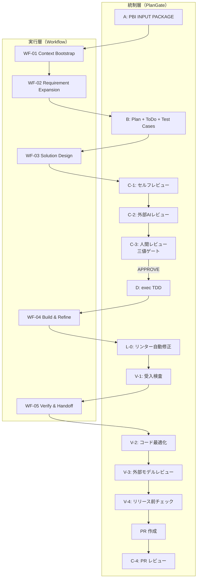

# PlanGate 既存フェーズへの WF-01〜WF-05 挿入位置

> PlanGate × Workflow / Skill / Agent ハイブリッドアーキテクチャ
>
> 親 PBI: [#22](https://github.com/s977043/plangate/issues/22)

## 位置付け

PlanGate v5/v6 の既存フェーズ（A/B/C-1〜D/L-0/V-1〜V-4）と、v7 ハイブリッドで新設された Workflow 5 phase（WF-01〜WF-05）の **挿入位置と対応関係** を図示する。

## 挿入位置図



## WF-03 Solution Design の挿入位置（詳細）

WF-03 は **B（Plan）と C-1（セルフレビュー）の間** に挿入される。

```text
A → WF-01 → WF-02 → B → [ WF-03 ] → C-1 → C-2 → C-3 → D
                        ↑
                        ここに挿入
```

### 挿入の意義

| 挿入前（v5/v6） | 挿入後（v7 ハイブリッド） |
| ---------------- | ---------------------- |
| B（plan.md 生成）→ 直接 C-1 | B → **WF-03（design.md 生成）** → C-1 |
| plan.md に設計要素が混在 | plan.md = 計画、design.md = 設計（分離） |
| 実装前の設計抜けが発生しやすい | 設計 artifact で抜けを防ぐ |

## WF-05 Verify & Handoff の挿入位置（詳細）

WF-05 は **V-1 と V-2 の間**、または **V-1 完了時点で並行実行** される。

```text
D → WF-04 → L-0 → V-1 → [ WF-05 ] → V-2 → V-3 → V-4 → PR
                         ↑
                         ここに挿入
```

### V-1 と WF-05 の並立意義

- V-1 は **実装ゲート**（PASS/FAIL 判定）
- WF-05 は **完了後の資産化**（handoff package 生成）
- 両者は役割が異なるため並立する

## plan.md / design.md / handoff.md の役割分担

| ファイル | 役割 | 出力者 | 変化頻度 | 対象読者 |
| --------- | ------ | ------- | --------- | --------- |
| plan.md | やる順番・完了条件 | `spec-writer` / `workflow-conductor` | チケット毎 | 実装者・レビュアー・PM |
| design.md | 実装構造の決定事項 | `solution-architect` | チケット毎 + アーキ変更時 | 実装者・アーキテクト |
| handoff.md | 完了時の引き継ぎパッケージ | `qa-reviewer` / `orchestrator` | TASK 完了時 | 次の担当者、監査 |
| status.md | フェーズ履歴アーカイブ | `workflow-conductor` | フェーズ遷移毎 | 未来の担当者、監査 |
| current-state.md | 今の状態スナップショット | 随時 | タスク完了毎 | 現担当者、セッション復旧時 |

## 既存 PlanGate ユーザーへの推奨移行パス

### Phase 1: Opt-in（現状）

- 既存 A/B/C-1〜V-4 フローはそのまま
- WF-03 / WF-05 は **optional で追加採用**（design.md / handoff.md の作成を推奨）

### Phase 2: Default（将来）

- design.md / handoff.md を全 PBI で必須化
- `.claude/rules/` で強制

### Phase 3: Full v7（将来）

- 責務ベース Agent 5 体で実行
- 既存 PlanGate Agent は legacy として温存

## 参照

- Workflow 基本定義: `docs/workflows/README.md`
- Workflow 各 phase: `docs/workflows/0N_*.md`
- 実行シーケンス: `docs/workflows/execution-sequence.md`
- design.md テンプレート: `docs/working/templates/design.md`
- handoff.md テンプレート: `docs/working/templates/handoff.md`
