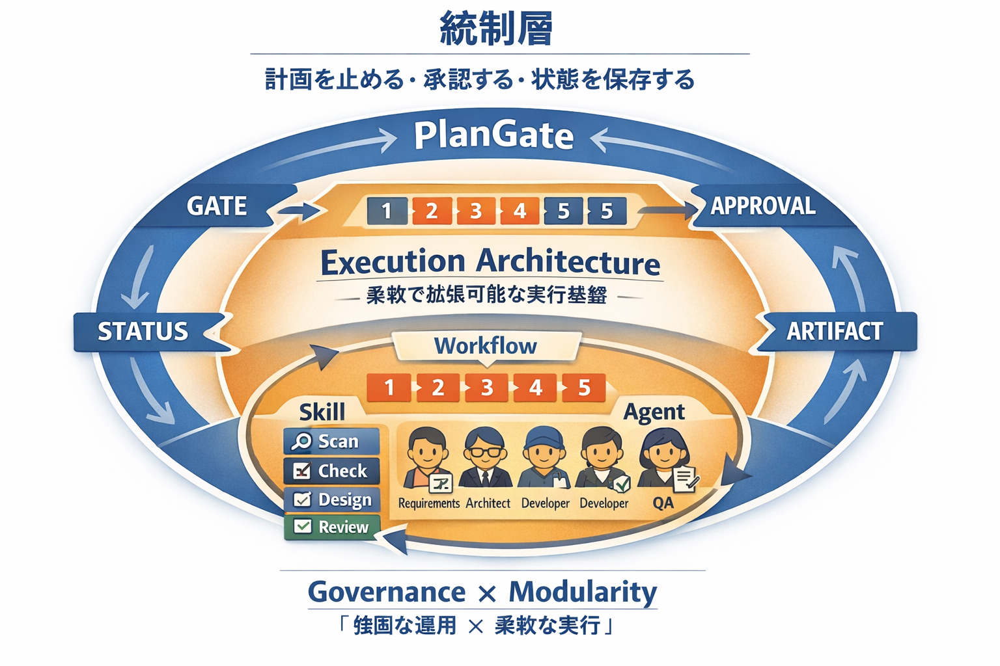

# PBI INPUT PACKAGE: PlanGate × Workflow / Skill / Agent ハイブリッドアーキテクチャ導入

> 作成日: 2026-04-19
> PBI: PlanGate × Workflow / Skill / Agent ハイブリッドアーキテクチャを導入する
> チケットURL: https://github.com/s977043/plangate/issues/22
> サブ issue: #23 (A) / #24 (B) / #25 (C) / #26 (D) / #27 (E) / #28 (F)

---

## Context / Why

### キャッチコピー

**Governance × Modularity =「強固な運用 × 柔軟な実行」**

### 現状分析

PlanGate は「統制が強い」が、観点が `plan.md` やレビュー手順に寄りやすく、**再利用性と拡張性**に改善余地がある。

| 強み / 弱み | PlanGate 単体 | ハイブリッド案（Workflow/Skill/Agent） |
|---|---|---|
| 強み | 計画承認ゲート、artifact 正本化、暴走防止 | 再利用性、拡張性、責務分離 |
| 弱み | 観点が plan/review に寄り、実行主体の整理が弱い | 「止める・承認する」機構が弱い |

両者は補完関係にあり、**PlanGate を外殻（ガバナンス層）、Workflow/Skill/Agent を内核（実行アーキテクチャ層）**として組み合わせることで、PlanGate の良さを消さず、中身を部品化してスケールさせる方向で進化できる。

### アーキテクチャ全体像



- **統制層（PlanGate）**: 計画を止める・承認する・状態を保存する
  - GATE / STATUS / APPROVAL / ARTIFACT の4軸
- **実行層（Execution Architecture）**: 柔軟で拡張可能な実行基盤
  - Workflow（5 phase） / Skill（4カテゴリ: Scan/Check/Design/Review） / Agent（5責務）

---

## What（Scope）

### In scope

#### 逆輸入改善点（優先順位順）

1. **review 観点の Skill 化** — 毎回 plan に埋め込まず、再利用資産にする
2. **solution-architect を独立フェーズ化** — 要件と実装の間の設計抜けを減らす
3. **Verify & Handoff を標準 phase 化** — 完了時に known issues / V2候補 / handoff を必須化
4. **責務ベース subagent** — FE/BE/QA の役職ベースではなく、requirements / design / implement / verify に寄せる

#### Workflow 層（5 phase）

| Phase | 目的 | 完了条件 |
|---|---|---|
| **WF-01 Context Bootstrap** | 案件の前提・制約・品質基準を読み込む | 対象範囲 / 使える技術 / 禁止事項 / 成果物定義が明文化 |
| **WF-02 Requirement Expansion** | 曖昧な要求から仕様の抜け漏れを洗い出す | 機能要件 / 非機能要件 / 対象外 / 例外条件 / UX期待値が整理 |
| **WF-03 Solution Design** | 仕様を実装可能な構造へ落とす | モジュール構成 / データフロー / 状態管理方針 / 失敗時扱い / テスト観点が決定 |
| **WF-04 Build & Refine** | 設計に従って最小単位で実装 | 動作するコード / 自己レビュー / 明示的な既知課題 |
| **WF-05 Verify & Handoff** | 品質確認し、次フェーズへ渡せる状態にする | 要件適合確認 / 既知課題一覧 / V2候補 / 引き継ぎ文書 |

#### Skill 層（10個）

| Skill | 役割 | 出力 | カテゴリ |
|---|---|---|---|
| context-load | CLAUDE.md と依頼文から前提を抽出 | 前提サマリ | Scan |
| requirement-gap-scan | 要件の抜け漏れ検出 | 追加要件候補 | Scan |
| nonfunctional-check | 性能・保守性・安全性の確認 | 非機能要件 | Check |
| edgecase-enumeration | 境界条件・例外条件の列挙 | エッジケース一覧 | Check |
| risk-assessment | 制約・未確定要素の洗い出し | リスク一覧 | Check |
| acceptance-criteria-build | 受け入れ条件の明文化 | AC一覧 | Design |
| architecture-sketch | 構成案の叩き台作成 | 構成案 | Design |
| feature-implement | 個別機能の実装 | コード差分 | Build |
| acceptance-review | 要件適合レビュー | 適合/不足一覧 | Review |
| known-issues-log | 妥協点・既知不具合の文書化 | 既知課題表 | Review |

#### Agent 層（5体・責務ベース）

| Agent | 責務 |
|---|---|
| **orchestrator** | ワークフロー遷移管理 / 誰に何を渡すか決める / 完了条件判定 |
| **requirements-analyst** | 初期要求を仕様に変換 / 曖昧さ・抜け漏れ・対象外を整理 |
| **solution-architect** | 実装構造を設計 / 依存制約や技術的妥協点を明文化 |
| **implementation-agent** | コードを書く / 小さな単位で自己レビュー / 既知課題を残す |
| **qa-reviewer** | 要件適合・回帰・未考慮ケースを確認 / V1/V2 の境界整理 |

#### 再構築ルール（Rule 1〜5）

| Rule | 内容 |
|---|---|
| Rule 1 | **Workflow は順序と完了条件だけを持つ**。実装ノウハウは書かない |
| Rule 2 | **Skill は再利用単位に限定する**。案件固有の話を入れない |
| Rule 3 | **Agent は責務だけを持つ**。ツール固有手順や案件固有仕様は持たせない |
| Rule 4 | **案件固有情報は CLAUDE.md に寄せる**。Agent や Skill に埋め込まない |
| Rule 5 | **最終成果物は毎回 handoff に集約する**。仕様 / 既知課題 / V2候補 / 確認結果を残す |

#### ファイル配置（Claude Code 前提）

```text
plangate/
├─ CLAUDE.md
├─ .claude/
│  ├─ settings.json      # Hook 定義（決定論的制御）
│  ├─ commands/          # 再利用手順（Skill 全10個）
│  │  ├─ context-load.md
│  │  ├─ requirement-gap-scan.md
│  │  ├─ nonfunctional-check.md
│  │  ├─ edgecase-enumeration.md
│  │  ├─ risk-assessment.md
│  │  ├─ acceptance-criteria-build.md
│  │  ├─ architecture-sketch.md
│  │  ├─ feature-implement.md
│  │  ├─ acceptance-review.md
│  │  └─ known-issues-log.md
│  └─ agents/            # 専門実行主体（Agent 5体）
│     ├─ orchestrator.md
│     ├─ requirements-analyst.md
│     ├─ solution-architect.md
│     ├─ implementation-agent.md
│     └─ qa-reviewer.md
└─ workflows/            # 順序と完了条件（Workflow）
   ├─ 01_context_bootstrap.md
   ├─ 02_requirement_expansion.md
   ├─ 03_solution_design.md
   ├─ 04_build_and_refine.md
   └─ 05_verify_and_handoff.md
```

#### CLAUDE.md / Skill / Hook の境界ルール

| 対象 | 役割 | 置き場所 | 例 |
|---|---|---|---|
| **CLAUDE.md** | 案件固有情報、常時必要な文脈 | プロジェクトルート | プロジェクトルール、技術スタック、禁止事項 |
| **Skill** | 再利用可能な手順・観点（必要時だけ読み込む） | `.claude/commands/` or `.claude/skills/` | requirement-gap-scan, acceptance-review |
| **Hook** | 強制力が必要な決定論的制御（100%強制） | `.claude/settings.json` の hooks | PreToolUse で plan.md 未存在なら block、Stop で evidence 未存在なら exit |

この境界ルールは Rule 4 を補完する。Rule 4 は「案件固有情報は CLAUDE.md」と定めるが、**強制力の軸**ではさらに Hook が加わる。

### Out of scope

- スクラム側責務（PBI情報管理、Done条件確認、ベロシティ計測）への介入
- 既存 TASK-0016（plugin 化）の実装内容
- Codex CLI 向け配布方式への統合
- deterministic hooks の実装本体（本PBIでは設計原則のみ）
- 既存 workflow の全面的な仕様変更（共存可能な形で追加）

---

## 受入基準

- [ ] **Workflow 5 phase**（WF-01〜WF-05）が `workflows/` 配下に定義され、各 phase に 目的／入力／完了条件／呼び出しSkill／主担当Agent が明記されている
- [ ] **Skill 10個** が `.claude/commands/` または `.claude/skills/` に配置され、入出力が定義されている
- [ ] **Agent 5体** が `.claude/agents/` に配置され、責務・委譲関係・allowed-tools が定義されている
- [ ] **Solution Design phase（WF-03）** が独立フェーズとして成立し、設計 artifact が出力される
- [ ] **Verify & Handoff phase（WF-05）** で known issues / V2候補 / handoff 文書が**毎回必須出力**になっている
- [ ] **Rule 1〜5** が `docs/` 配下のルールドキュメントに明文化されている
- [ ] **CLAUDE.md / Skill / Hook の境界ルール**（案件固有=CLAUDE.md / 再利用=Skill / 強制=Hook）が明文化されている
- [ ] 既存 PlanGate v5/v6 ドキュメント（`docs/plangate.md`, `docs/plangate-v6-roadmap.md`）との整合が取れている
- [ ] 実行シーケンス（orchestrator → requirements-analyst → qa-reviewer → solution-architect → implementation-agent → qa-reviewer → orchestrator）が動く状態でドキュメント化されている

---

## Notes from Refinement

### ユーザー提供の3つの入力

本 PBI は以下3回のユーザー入力を統合したもの:

#### 入力1: 全体像と推奨アーキテクチャ

- 外側に PlanGate、内側に Workflow / Skill / Agent を置く
- ガバナンス層（gatekeeper / status.md / plan.md / approval state / hooks）と実行層（Workflow / Skill / Agent）の2層構造
- 最終形の一文: **「PlanGate は『統制の外殻』、Workflow / Skill / Agent は『実行の内核』」**

#### 入力2: アーキテクチャ図（画像）

- 統制層 = 計画を止める・承認する・状態を保存する
- PlanGate の4責務: GATE / STATUS / APPROVAL / ARTIFACT
- Execution Architecture = 柔軟で拡張可能な実行基盤
- Skill の4カテゴリ: Scan / Check / Design / Review
- Agent 5体（責務ベースの正規定義）: **orchestrator / requirements-analyst / solution-architect / implementation-agent / qa-reviewer**
  - 画像上のキャラクター表記（Requirements / Architect / Developer / Developer / QA）は視覚的表現であり、実際の責務は上記5責務に対応する
- キャッチコピー: **Governance × Modularity =「強固な運用 × 柔軟な実行」**

#### 入力3: 逆輸入改善点の優先順位と詳細設計

- 優先順位付き4改善点（review観点Skill化 / solution-architect独立 / Verify&Handoff標準化 / 責務ベースsubagent）
- Workflow 5 phase の詳細定義（入力・完了条件・呼び出しSkill・主担当Agent）
- Skill 10個の入出力定義
- Agent 5体の責務定義
- 実行シーケンス（1〜7）
- Claude Code ファイル配置案
- 再構築ルール Rule 1〜5

### 実行シーケンス

1. orchestrator が WF-01 を開始
2. requirements-analyst が requirement-gap-scan で仕様拡張
3. qa-reviewer が edgecase-enumeration と acceptance-criteria-build で締める
4. solution-architect が WF-03 で実装構造化
5. implementation-agent が WF-04 で実装
6. qa-reviewer が WF-05 で要件照合
7. orchestrator が handoff を出す

### 想定モード判定

**full**（高）を想定。

- 変更ファイル数: 16+ 体（Workflow 5 + Skill 10 + Agent 5 + ルール + 統合ドキュメント）
- 受入基準数: 9 件
- 変更種別: アーキテクチャ再構成（実行基盤の拡張）
- リスク: 中（既存 PlanGate v5/v6 との共存が必要）
- 影響範囲: 複数レイヤー（ルール / 実行基盤 / ドキュメント）

---

## Estimation Evidence

### Risks

| Risk | Severity | Mitigation |
|------|----------|-----------|
| 既存 PlanGate v5/v6 ワークフローとの重複・競合 | Medium | 統合ドキュメント（v7-hybrid など）で境界と共存方式を明示 |
| Skill と既存 `.claude/skills/` の区別が曖昧になる | Medium | Rule 1〜5 に従い、観点系Skillは commands に、手順系は skills に分ける基準を策定 |
| Agent 5体と既存 `.claude/agents/` の責務重複 | Medium | 責務ベース設計（Rule 3）で再定義し、既存との対応表を作成 |
| Workflow phase と PlanGate フェーズ（A/B/C-1〜D/L-0/V-1〜V-4）の二重管理 | Medium | PlanGate のフェーズを「統制層」、Workflow phase を「実行層」として明確に分離 |
| TASK-0016（plugin 化）との実装競合 | Low | 親issue間で依存関係を明示（本PBI は TASK-0016 の plugin 構成をベースに利用） |

### Unknowns

- 既存 `.claude/agents/` のうち本構成に吸収可能なもの / 新規作成が必要なものの切り分け
- Workflow phase の完了条件を自動検証する仕組み（hooks 連携）の詳細
- PlanGate v6 の P1〜P5（決定論的フック / GC / ルール昇格 / 推論サンドイッチ / ファセットプロンプティング）との接続順序
- handoff package の具体的テンプレート（現行の status.md との違い）

### Assumptions

- Claude Code は subagents / commands / project memory を持ち、本 3 層モデルと噛み合う
- 既存 PlanGate v5 の plan.md / status.md / review-self.md はそのまま活用可能で、追加 artifact を積み増す形で統合できる
- Rule 1〜5 を満たせば、ロール依存の運用から構造化された AI 実行基盤へ移行できる
- Workflow / Skill / Agent の3層分離は、TASK-0016 の plugin 構成と両立する

---

## サブ issue 構成

| # | タイトル | 対応改善点 | 依存 |
|---|---|---|---|
| #23 (A) | Workflow 5 phase を定義する（WF-01〜WF-05） | 基盤 | - |
| #24 (B) | 再利用可能な Skill 10個を整備する | ① review観点Skill化 | #23 |
| #25 (C) | 責務ベース Agent 5体を整備する | ④ 責務ベースsubagent | #23 |
| #26 (D) | Solution Design phase を独立させる（WF-03） | ② solution-architect独立 | #23, #24, #25 |
| #27 (E) | Verify & Handoff を標準 phase 化する（WF-05） | ③ Verify&Handoff標準化 | #23, #24, #25 |
| #28 (F) | Rule 1〜5 と PlanGate ガバナンス層の統合ルールを明文化 | 境界ルール | #23-#27 並行 |

---

## 次フェーズへの申し送り

このPBI INPUT PACKAGE は **C-3 ゲート（plan 承認）前の素材**として、次フェーズで以下に展開される:

1. **B: plan 生成** — workflow-conductor 経由で `plan.md` / `todo.md` / `test-cases.md` を生成
2. **C-1: セルフレビュー** — 17 項目チェック（full モードのため）
3. **C-2: 外部AIレビュー** — full モードで必須
4. **C-3: 人間レビュー** — 三値ゲート（APPROVE / CONDITIONAL / REJECT）

**モード判定**: `full`（plan.md の Mode判定セクションで確定）
