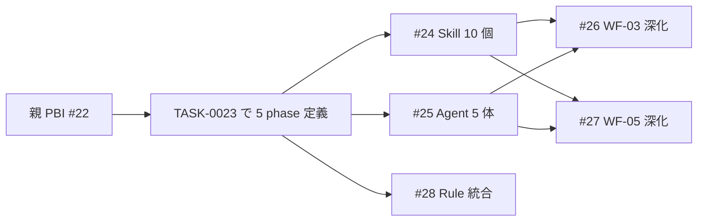

# サンプル: Design Artifact（TASK-0023 題材）

> 参考例として TASK-0023（WF-01〜WF-05 phase 定義）の design.md を書いた場合のサンプル。
> 実際の TASK-0023 はドキュメントのみのため簡潔版。

## メタ情報

```yaml
task: TASK-0023
related_issue: https://github.com/s977043/plangate/issues/23
author: solution-architect
updated: 2026-04-20
```

## 1. モジュール構成（境界と責務）

| モジュール | 責務 | 公開 API / インターフェース | 配置 |
|-----------|------|--------------------------|------|
| Phase 定義 | 各 phase の目的・入力・完了条件を記述 | Markdown ドキュメント | `docs/workflows/0N_*.md` |
| 対応表（README） | PlanGate 既存フェーズとの対応を明示 | 表形式 Markdown | `docs/workflows/README.md` |
| skill-mapping | Phase × Skill のマッピング | 表形式 Markdown | `docs/workflows/skill-mapping.md` |

**境界判断の根拠**:
- 各 phase を独立ファイルにすることで、個別更新を容易にする
- README は索引として機能、実体定義は別ファイルに分離（Rule 1 遵守）

## 2. データフロー



**主要な変換**:
- 親 PBI の「Workflow 層」記述 → 5 phase 定義ファイル
- 各 phase の Skill/Agent 仮称 → 後続 TASK で実体に解決

## 3. 状態管理方針

- **状態の所有者**: ファイルシステム（git 管理下）
- **永続化**: Markdown ファイルとしてコミット
- **キャッシュ戦略**: N/A（静的ドキュメント）
- **トランザクション境界**: git コミット単位

## 4. 失敗時の扱い

| 失敗モード | 検出 | 対応 |
|----------|------|------|
| phase 定義の構造不整合 | frontmatter 検証スクリプト | CI で検出、修正コミット |
| README 対応表のリンク切れ | 手動レビュー + 将来の自動 link check | PR レビュー時に指摘 |
| Rule 1 違反（実装ノウハウ混入） | grep ベース検証（TC-2） | 指摘 → 修正コミット |

## 5. テスト観点

| レイヤー | テスト種別 | カバー範囲 |
|---------|----------|----------|
| Unit | frontmatter 検証 | 各 phase ファイルの phase_id / name / order 必須キー |
| Integration | 対応表整合 | README の対応表と実際のファイル配置の一致 |
| E2E | 手動レビュー | 第三者が読んで phase の流れが理解できるか |

**境界条件**:
- phase 数 = 5 固定
- phase_id は `WF-01` 〜 `WF-05` の 5 種のみ

## 6. 依存ライブラリ制約

本 TASK はドキュメント作成のみのため、ランタイム依存なし。

| 依存 | バージョン | 理由 | 制約 |
|------|----------|------|------|
| Mermaid | CommonMark 標準拡張 | 図示のため | GitHub の Markdown レンダリングに依存 |

**新規追加**: なし
**更新**: なし

## 7. 技術的妥協点

| 項目 | V1 対応 | V2 候補 | 理由 |
|------|--------|--------|------|
| 自動検証スクリプト | なし（手動確認） | shell script で frontmatter 検証 | TASK-0023 のスコープ外、別 TASK で対応 |
| phase 実行エンジン | なし（ドキュメントのみ） | hooks 連動の自動 phase 遷移 | 現行 PlanGate ガバナンス層で代替可、別 TASK |
| Skill/Agent 仮参照 | 名前参照のみ | 完了時に実リンク化 | #24/#25 完了を待つ必要あり、本 TASK は独立運用可能 |

**ロールバック計画**: `docs/workflows/` ディレクトリを丸ごと削除すれば戻せる（既存 PlanGate フローに影響なし）。

## 次 phase への引き継ぎ

- [x] モジュール構成が決定している
- [x] データフロー図がある
- [x] 状態管理方針が決定している
- [x] 失敗時の扱いが決定している
- [x] テスト観点が決定している
- [x] 依存ライブラリ制約が一覧化されている（本 TASK は依存なし）
- [x] 技術的妥協点が明示されている（V2 候補含む）

---

## 備考

本サンプルは TASK-0023（2026-04-20 PR #35 でマージ済）の振り返り用 design.md として作成。
実プロジェクトでは、TASK 着手前に solution-architect が作成し、implementation-agent に引き継ぐフローとなる。
