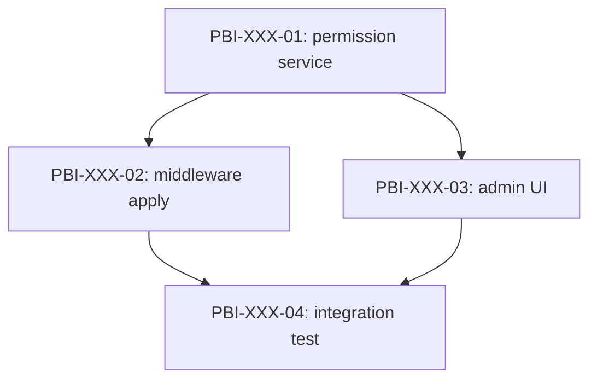

# Dependency Graph — PBI-XXX

> **Template**: PlanGate Orchestrator Mode 子 PBI 依存関係グラフテンプレート
> 関連: [`docs/orchestrator-mode.md`](../../orchestrator-mode.md) / Issue #109
> 用途: 子 PBI 群の依存関係を mermaid で可視化

## メタデータ

| 項目 | 値 |
|------|---|
| Parent PBI ID | PBI-XXX |
| Generated at | YYYY-MM-DD |
| Last updated | YYYY-MM-DD |
| Generator | 手動 / `plangate decompose`（実装後）|

## Graph

凡例:

- `A --> B`: B は A の完了に依存（A が `child:done` でないと B 開始不可）
- ノード: 子 PBI ID とタイトル

## Edges（依存関係一覧）

| From | To | 種別 | 理由 |
|------|----|----|------|
| PBI-XXX-01 | PBI-XXX-02 | 順序依存 | middleware は permission service の API を使用 |
| PBI-XXX-01 | PBI-XXX-03 | 順序依存 | UI は permission service の API を使用 |
| PBI-XXX-02 | PBI-XXX-04 | 順序依存 | E2E テストは middleware 適用後に実施 |
| PBI-XXX-03 | PBI-XXX-04 | 順序依存 | E2E テストは UI 適用後に実施 |

依存種別:

- **順序依存**: 機能的に前の PBI 完了を要する
- **データ依存**: schema や定数の確定を要する
- **境界依存**: 同一ファイルを変更するため順序整理が必要

## 循環依存チェック

- [ ] グラフが DAG（有向非循環グラフ）であることを確認
- [ ] 検出ツール（例: `tsort` / 手動）で循環なしを確認

循環検出時は親計画 Step D-3 に差し戻す。

## 並行実行ヒント

dependency-graph から並行実行可能なノード（同 depth）を列挙:

- **Layer 0**: PBI-XXX-01
- **Layer 1**: PBI-XXX-02, PBI-XXX-03（並行可能）
- **Layer 2**: PBI-XXX-04

詳細は [`parallelization-plan.md`](./parallelization-plan.md) で並行可否を最終判定する。
