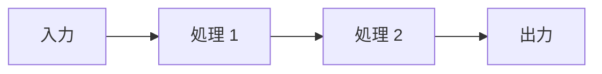

# Design Artifact テンプレート

> WF-03 Solution Design の成果物。`solution-architect` Agent が主担当。
> 配置先: `docs/working/TASK-XXXX/design.md`（1 PBI につき 1 ファイル）

## メタ情報

```yaml
# 冒頭に記載
task: TASK-XXXX
related_issue: <issue URL>
author: solution-architect
updated: YYYY-MM-DD
```

## 1. モジュール構成（境界と責務）

各モジュールの境界・責務・公開インターフェースを記述する。

| モジュール | 責務 | 公開 API / インターフェース | 配置 |
|-----------|------|--------------------------|------|
| <module-1> | <責務> | <メソッド/関数 signature> | <path> |
| <module-2> | ... | ... | ... |

**境界判断の根拠**:
- <なぜこの境界でモジュールを分けたか>


## 1-bis. 視覚設計（UI タスク時のみ・非UIは省略可 / F3）

> pbi-input の Design/UI Addendum（[`docs/ai/design-ui-addendum.md`](../../ai/design-ui-addendum.md)）
> を設計へ反映する。真実源（Figma あり→Figma正 / なし→既存パターン正 /
> 参照なし→明示）を固定し、設計と受入で視覚要件を一貫させる。

| 項目 | 設計内容 |
|------|---------|
| 踏襲元（X / not Y・理由） | <真似る既存実装 / 真似ない実装と理由> |
| 真実源 | <Figma ノード URL / 既存パターン path / `[参照なし]`> |
| 配置・余白（トークン名） | <挿入位置・間隔> |
| レスポンシブ（PC/SP） | <各ビューポートの期待表示> |
| 視覚的受入基準 | <検証可能な合否条件> |
| 視覚的回帰ガード | <変更禁止の既存表示> |
| 視覚証跡 | <Figma 対比 / before-after・ビューポート別> |

## 2. データフロー

データが入力〜出力までどう流れるかを記述する（図 + 説明）。



**主要な変換**:
- <入力形式> → <中間形式> → <出力形式>

## 3. 状態管理方針

アプリケーション状態・永続化・キャッシュ・トランザクション境界を記述する。

- **状態の所有者**: <どのレイヤーが状態を保持するか>
- **永続化**: <DB / ファイル / メモリ>
- **キャッシュ戦略**: <TTL / 無効化条件>
- **トランザクション境界**: <ACID 適用範囲>

## 4. 失敗時の扱い（エラーパス / リトライ / フォールバック）

各失敗モードへの対応を記述する。

| 失敗モード | 検出 | 対応 |
|----------|------|------|
| <入力検証エラー> | <バリデーション層> | <400 返却、ログ> |
| <外部 API タイムアウト> | <HTTP クライアント> | <リトライ N 回 + フォールバック> |
| <DB 接続失敗> | <起動時 health check> | <サーキットブレーカー> |

**リトライポリシー**: <指数バックオフ / 固定間隔 / 回数制限>
**フォールバック**: <代替経路の設計>

## 5. テスト観点

各レイヤーでどのテストを書くかを記述する（Rule 1 遵守のため、具体的なテストコードは書かない）。

| レイヤー | テスト種別 | カバー範囲 |
|---------|----------|----------|
| Unit | Unit | <関数・クラス単位のロジック> |
| Integration | Integration | <モジュール間連携、DB 接続等> |
| E2E | E2E | <ユーザーシナリオ、UI 含む> |

**境界条件**:
- <エッジケース名>: <テスト対象>

## 6. 依存ライブラリ制約

使用するライブラリ・フレームワーク・バージョン・制約を記述する。

| 依存 | バージョン | 理由 | 制約 |
|------|----------|------|------|
| <lib-1> | ^x.y.z | <採用理由> | <既存コードベースとの整合、破壊的変更回避等> |

**新規追加**: <このチケットで新規追加する依存>
**更新**: <このチケットで更新する依存>

## 7. 技術的妥協点（V1 で諦める範囲）

今回のリリース（V1）で実装せず、V2 候補として先送りする項目を記述する。

| 項目 | V1 対応 | V2 候補 | 理由 |
|------|--------|--------|------|
| <項目 1> | <最小実装 or スキップ> | <将来の完全対応> | <時間制約 / 技術的難易度 / スコープ> |

**ロールバック計画**: <V1 実装から戻す必要がある場合の手順>

## 次 phase への引き継ぎ

本 design artifact は `implementation-agent` が WF-04 で参照する。
以下が実装前に揃っていることを確認:

- [ ] モジュール構成が決定している
- [ ] データフロー図がある
- [ ] 状態管理方針が決定している
- [ ] 失敗時の扱いが決定している
- [ ] テスト観点が決定している
- [ ] 依存ライブラリ制約が一覧化されている
- [ ] 技術的妥協点が明示されている（V2 候補を含む）

---

## 使い方

1. このテンプレートを `docs/working/TASK-XXXX/design.md` にコピー
2. 各セクションを埋める（`<...>` のプレースホルダーを実値に置換）
3. `solution-architect` Agent がレビューし、`implementation-agent` に引き継ぐ

## 関連

- Workflow: `docs/workflows/03_solution_design.md`
- Agent: `.claude/agents/solution-architect.md`
- Skill: `architecture-sketch` / `risk-assessment`
- plan.md との関係: `plan.md` は「やる順番・完了条件」、`design.md` は「実装構造の決定事項」
